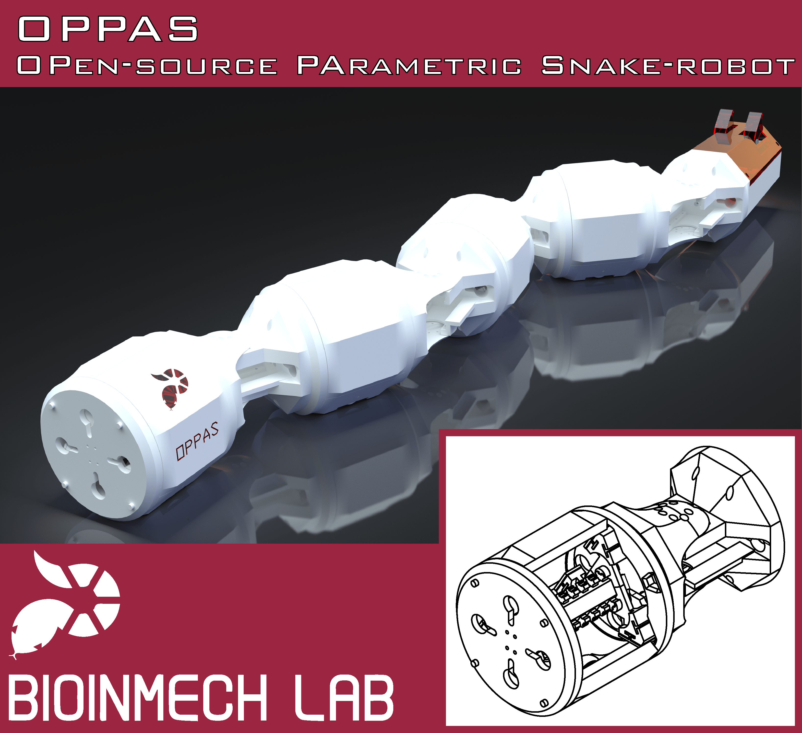

# OPPAS: OPen-source PArametric Snake-robot

**OPPAS** is a snake robot intended for research with robots that mimic the structure of a snake.
The main reason I started this project is because I wanted a fast way to produce a snake robot that was easy to build and deploy, but without the need of drastic hanges if a component of the robot changes.
The documentation is published in [OPPAS documentation](https://fabreyesmecha.github.io/OPPAS/), but OPPAS's project files can be downloaded in [https://grabcad.com/library/oppas-open-source-parametric-snake-robot-1](https://grabcad.com/library/oppas-open-source-parametric-snake-robot-1).



In essence, a snake robot is very simple; it is a series of links connected by joints.
However, the shape and size of the links and joints will change depending on the components you use.
For example, a big battery may requiere a long but slender link.
But, depending on the microcontroller you use, you may need a short but thick link.
Although putting together a bunch of u-brackets and other rigid parts is easy, this leaves the electronics and other components exposed, while at the same time properly fixing the components to the robot may be difficult.
By making the design parametric, different snake robots can be produced, according to your requirements.

Another property I was interested in was modularity.
By modularity I mean that a module (link + joint) of the snake robot is composed of different elements that can be interchanged without needing to redesign other parts.
For example, if your snake robot requiers passive wheels (e.g., for achieving anisotropic friction) just design the 'belly' of the robot without altering the rest.
Or, you may change the wheel's model and redesign the necessary part.
You are using a bigger battery that doesn't fit the current robot? Just make a longer link without affecting the joints.

However, there are some sacrifices to be made to keep the desig as general as possible.
Since the design is parametric (and the number of parameters is limited) the design is not optimal.
In other words, there may be a lot of *wasted* space inside the robot.

OPPAS is an attempt to make snake robots easier to build and to test your ideas.
It is **open-source**; the robot was designed using Autodesk Fusion 360.
The files can be downloaded and the whole project can be recreated in your computer.
I consider this to be more useful than sharing .STL files that have to be downloaded and modified to fit your needs.
As mentioned before, OPPAS is **parametric**.
Read the documentation for information about the available parameters.
Finally, I wanted a robot that could be afforded by anyone.
The current version of OPPAS has been printed in ABS using a Zortrax M200.
Although the Zortrax may not be affordable by everyone, I have printed also some parts in my own Overlord Pro, and although the tolerances are more difficult to overcome, it still works.
Each module costs less than US$20 (using eSun ABS).

The library to control the servos **DuoDMXL** (Duo-Dynamixel) is being developed and documented in:

* [DuoDMXL GitHUb repository](https://github.com/FabReyesMecha/DuoDMXL)
* [DuoDMXL documentation](https://fabreyesmecha.github.io/DuoDMXL/)

## Current version

As of [2017-05-01]: OPPAS Mk. 1.0

## Desired requirements for future versions

There are several weak points in the current design of OPPAS.
In particular, I would like to improve the following points:

1. **Waterproof**: Make the design waterproof.
2. **Support for more servos**:  Currently, OPPAS Mk. 1.0 is designed with the ROBOTIS MX-64 servos in mind. I would like to support more servo's models in the future, but parametrizing them is rather difficult (e.g., they have different shapes, the screw holes positions are in different arrangements).
3. **Smaller**: Due to the MX-64 servo's size, OPPAS Mk 1.0 is *big* in comparison to other snake robots. If possible, I would like to make it a little smaller next time.

## License

**OPPAS** is a project being developed in Ritsumeikan University, by the Biomimetic Intelligent Mechatronics (BioInMech) Laboratory.
**OPPAS** is licensed under the [Creative Commons Attribution 4.0 International](https://creativecommons.org/licenses/by/4.0/legalcode) license to **Fabian Eugenio Reyes Pinner** (Fabian Reyes) (2017).
A summary of the license is provided below:

```
You are free to:

    Share — copy and redistribute the material in any medium or format
    Adapt — remix, transform, and build upon the material
    for any purpose, even commercially.

    The licensor cannot revoke these freedoms as long as you follow the license terms.

    Under the following terms:

    Attribution — You must give appropriate credit, provide a link to the license, and indicate if changes were made. You may do so in any reasonable manner, but not in any way that suggests the licensor endorses you or your use.

    No additional restrictions — You may not apply legal terms or technological measures that legally restrict others from doing anything the license permits.
```

<a rel="license" href="http://creativecommons.org/licenses/by/4.0/"></a><br />This work is licensed under a <a rel="license" href="http://creativecommons.org/licenses/by/4.0/">Creative Commons Attribution 4.0 International License</a>.
The full license can be found here: [https://creativecommons.org/licenses/by/4.0/legalcode](https://creativecommons.org/licenses/by/4.0/legalcode)

BioInMech's logo is property of the BioInMech Laboratory.


